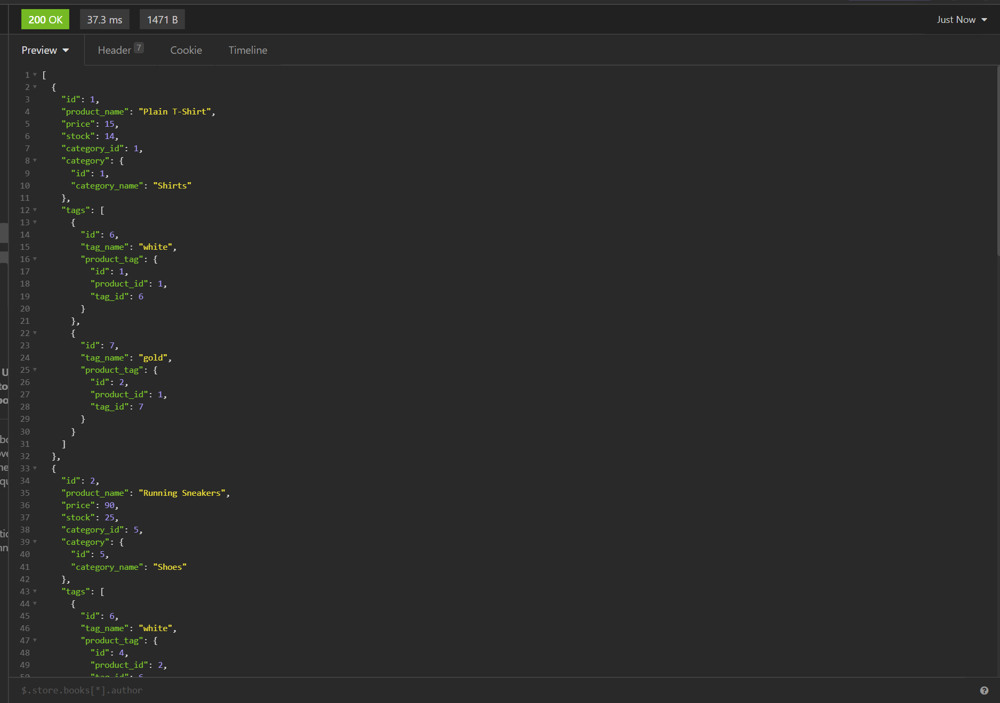

# e-commence

## Purpose
This application uses Sequelize to connect an Express.js API with a MySQL database to get, create, update, and delete data from the 'Category' 'Product' and 'Tag' tables.
## Outline
- run 'npm init' and 'npm install' to setup the application
- Then create a '.env' file and add 'DB_NAME' 'DB_USER' and 'DB_PW' to make the sequelize connection.
- Once the server is connected, the api endpoint routes can be used to interact with the 'Category' 'Product' and 'Tag' tables.

## Built With
* MySQL
* Sequelize
* Express.js

## Screenshot

## Walkthrough Video
[Video](https://drive.google.com/file/d/1oTFVq0xQKy0FFsD5NnWj8YzF0m4YL8cD/view)
## Contributor
j-maclellan